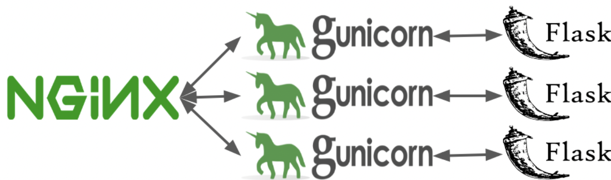

# Weather Map

The weather map is a flask app that reads current weather data from NOAA, creates a folium map and renders the map to the user.

This is a prototype and proof of concept.  In particular evalualte amethods and research for programmatic map making without a gis.  The goal is to assess resource requirements and constraints.

This implementation is run on AWS Lightsail using nginx, gunicorn and flask.  The architecture, pictured below,  is discussed this link  and evolved from several tutorials as stated below.

https://medium.com/@maheshkkumar/a-guide-to-deploying-machine-deep-learning-model-s-in-production-e497fd4b734a





* Nginx is a load balancer and reverse proxity.  It is used as an end point for web traffic and routes incoming http requests.

* Gunicorn creates multiple forks which are called workers to handle the requests.

* Flask is a micro web framework written in Python that handles http requests: GET, POST, etc.


## Working template for nginx/gunicorn/flask on aws lightsail.

### This work is adapted from:

https://towardsdatascience.com/how-to-deploy-ml-models-using-flask-gunicorn-nginx-docker-9b32055b3d0

and was deployed to ligntsail ec2 here:

Instructions are below:


### map implementation 
This will run from ec2 because docker images have to be uploaded to lightsail to create a deployment.  Docker images created on M1 processors fail on Lightsail containers.

1.  create an ubuntu ec2 instance (on lightsail)
  on lightsail create a static ip address - xx.xx.xxx.xxx.
2.  ssh to this instance from you local machine
```
ssh -i <your key> ubuntu@xx.xx.xxx.xxx
```

 install docker via docker-compose on the ec2 instance

```
sudo apt update

sudo apt upgrade

sudo apt install docker-compose

```

3.  install aws cli

https://docs.aws.amazon.com/cli/latest/userguide/getting-started-install.html

```
curl "https://awscli.amazonaws.com/awscli-exe-linux-x86_64.zip" -o "awscliv2.zip"

sudo apt install unzip

sudo ./aws/install

```

configure aws:
https://docs.aws.amazon.com/cli/latest/userguide/getting-started-quickstart.html
the parameter for the configure are given to you.

```
sudo aws configure

```

note:  it has to be sudo

AWS Access Key ID [None]: your id
AWS Secret Access Key [None]: your access key
Default region name [None]: us-west-2
Default output format [None]: json

4.  Install aws lightsail thing:

https://lightsail.aws.amazon.com/ls/docs/en_us/articles/amazon-lightsail-install-software

```

sudo curl "https://s3.us-west-2.amazonaws.com/lightsailctl/latest/linux-amd64/lightsailctl" -o "/usr/local/bin/lightsailctl"

sudo chmod +x /usr/local/bin/lightsailctl


```

5.  Clone this repository on the ec2 instance:

```
git clone https://github.com/marilynwaldman/lightsail-weather-map.git
cd lightsail-weather-map

```

6.  cd to nginx and change the project.conf server to localhost.  It is flask_app when running from docker-compose on ec2.


7.  The map server will run on a separate lightsail container.  Delete an existing container if it exists.  Log into your lightsail console to see if a service is running

```
sudo aws lightsail delete-container-service --service-name weather-service
```

Wait for the completion of this task before continuting.

8.  Build the docker images of the flask app and nginx on the ec2 instance.

cd to the repo and run the docker build commands.  These steps are formally discussed below.

```
cd  lightsail-map-server
sudo docker build -t flask-container ./flask
sudo docker build -t nginx-container ./nginx


```

9.  Create the static map service on lightsail from the ec2 instance


```
sudo aws lightsail create-container-service --service-name  weather-service \
--power small \
--scale 1
```

Use the get-container-services command to monitor the state of the container as it is being created.  

Also log into the lightsail console and check container services.

```
sudo aws lightsail get-container-services --service-name weather-service
```

10. Push the Flask application container to Lightsail with the push-container-image command.
```
sudo aws lightsail push-container-image --service-name weather-service \
--label flask-container \
--image flask-container
```

```
sudo aws lightsail push-container-image --service-name weather-service \
--label nginx-container \
--image nginx-container


```

From the lightsail console get the number of the images uploaded and update the containers.json file:

Either vi the ec2 file or update locally, push to github and pull on ec2.


11.  Deploy the containers:

Deploy the containers to the container service with the AWS CLI using the create-container-service-deployment command.

```
sudo aws lightsail create-container-service-deployment --service-name weather-service \
--containers file://containers.json \
--public-endpoint file://public-endpoint.json

```


### Some notes ; this stuff for testing locally on ec2 prior to lightsail distribution.
```

removing all containers and images
sudo docker rm $(sudo docker ps -a -f status=exited -q)
sudo docker ps -a
sudo docker stop $(sudo docker ps -a -q)
sudo docker rm $(sudo docker ps -a -q)
sudo docker rmi $(sudo docker images -a -q)
docker exec -it 9b3e605f8d54 /bin/sh
sudo docker exec -it 412c97d0a9fb /bin/sh
sudo docker logs 569668ca1756

sudo docker build -t flask-container ./flask

sudo aws lightsail push-container-image --service-name weather-service \
--label flask-container \
--image flask-container


sudo aws lightsail create-container-service-deployment --service-name weather-service \
--containers file://containers.json \
--public-endpoint file://public-endpoint.json


```
